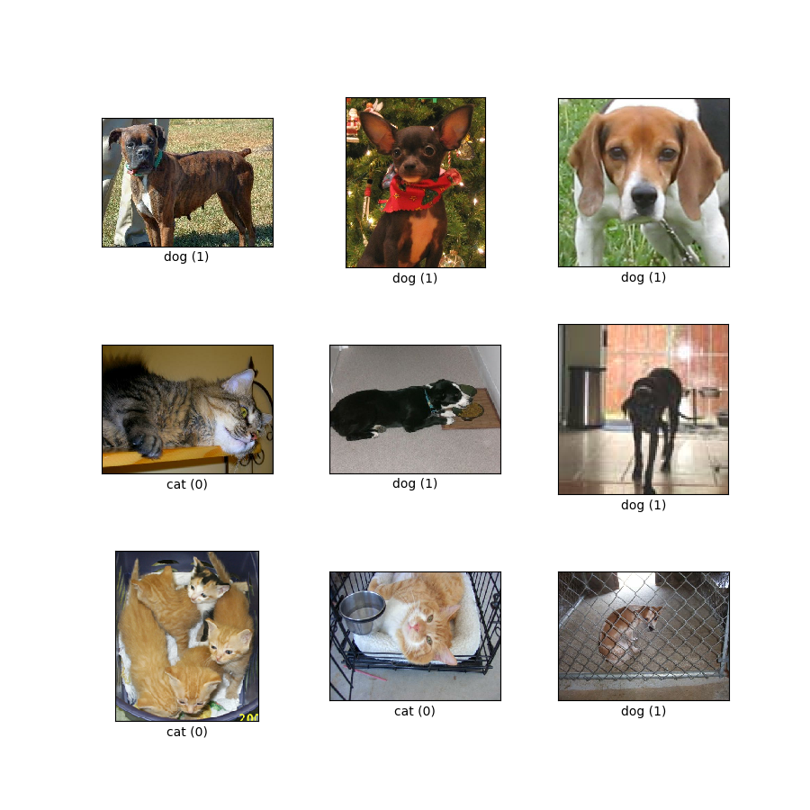
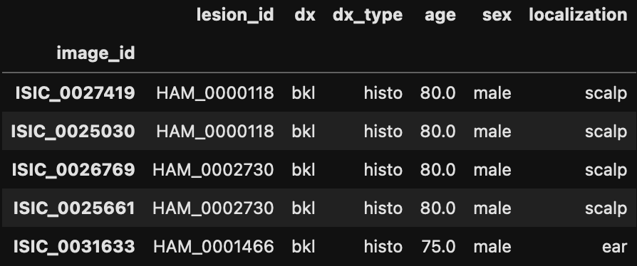

# How I became a part time (unpaid) dermatologist
## Hasib Ahmed

<!--
Some notes
-->

---
transition: slide-left
---
# Have you ever wanted to become something you're not?

- 🥼 **Doctor**
- 📈 **Stock trader**
- 👩🏼‍🚀 **Astronaut***

With code & a magic thing called ✨**Machine Learning**✨ you can! You can even do it part time, just like how I became a part time (unpaid) dermatologist 🔬

<div v-click>

</div>
<div v-click>*probably can't be an astronaut with just code</div>

<!--
I wanted to be a super secret spy when I was younger, the dream is still there

Portrait of me
-->

---
transition: slide-down
---

# What is Machine Learning?
<div v-click>

</div>

<!--
This is the general conception of what ML is
Scary, killer robots, taking over our lives
-->

---
transition: slide-up
---

# Reality
<div v-click>

</div>

<!--
The killer robots aren't so scary now right?
-->

---
transition: fade-out
---

# What is Machine Learning?


<div v-click>
<br>
We teach machines to guess what things are, or will, be based on lots and lots of examples
<br>
</div>

<div v-after>

</div>

---
transition: fade-out
---

# How do machines learn? 🧠💻

The machine or algorithm can understand whatever we tell it to understand. We pick out features, which is known as feature engineering, to help the algorithm to figure out what a piece of data is. A piece of data could be numbers, images, video, etc

<div v-click>
There are lots of different tools to help the machine learning model know what to understand, such as:
</div>
<div v-click>
<ul>
<li> Supervised learning
    <li> A person has to figure out each of these features from a piece of data and label it accordingly
    </li>
    </li>
</ul>
</div>

<!--
In simple terms.

now we've gone over some basic terminology, time to move onto

-->
---
transition: slide-left
---

# How do machines learn? 🧠💻 - Example



---
transition: slide-left
---

# How & why I become a part time Dermatologist

<div v-click>
A family member was  diagnosed with Alopecia areata which is a disease that happens when the immune system attacks hair follicles and causes hair loss.
</div>
<br>
<div v-click>
What other serious skin conditions are there?
</div>
<div v-click>
<ul>
<li><b>Melanoma</b></li>
<li>Benign keratosis</li>
<li>Melanocytic nevi</li>
<li>Basal cell carcinoma</li>
<li>Actinic keratoses</li>
<li>Vascular lesions</li>
<li>Dermatofibroma</li>
</ul>
</div>

<!--
& it got me thinking

One of the most serious is something called Melanoma. Now I know what I need, it's time to find some data on it
-->

---
transition: slide-left
---

# Now I need data & lots of it
<div v-click>
HAM10000 dataset: a large collection of multi-source dermatoscopic images of common pigmented skin lesions
</div>

<div v-click>
10, 000 images 🤔
    
</div>

<!--
- after looking through the interwebs I came across a gem
- great, now I have data... now what? I can't go through 10k images by hand
-->

---
transition: fade-out
---

# Explore the dataset
<div v-click>
```python
// Categories of the diferent diseases
lesion_type_dict = {
    'nv': 'Melanocytic nevi',
    'mel': 'Melanoma',
    'bkl': 'Benign keratosis ',
    'bcc': 'Basal cell carcinoma',
    'akiec': 'Actinic keratoses',
    'vasc': 'Vascular lesions',
    'df': 'Dermatofibroma'
}
```

</div>

<!--
some code to translate the skin lesion labels to something human readable
-->

---
transition: slide-left
---

# Explore the dataset

dd
