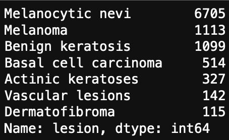
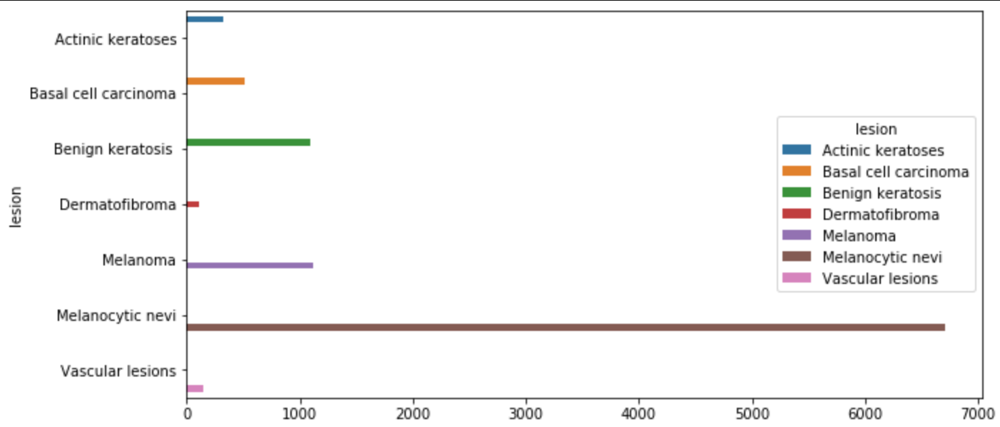
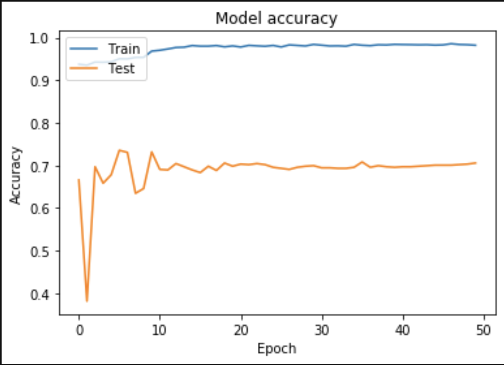
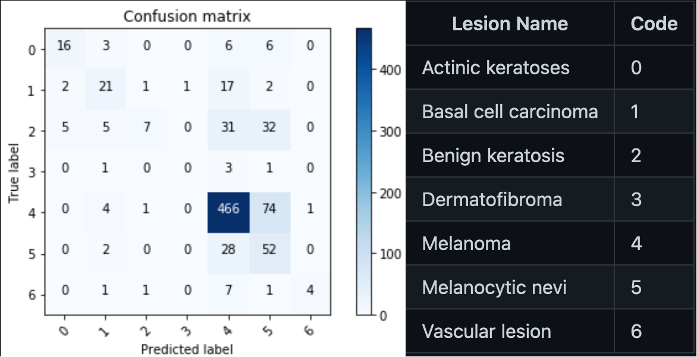

# How to become something you're not - my dermatologist story
## Hasib Ahmed

<!--
Some notes
-->

---
transition: slide-left
---
# Have you ever wanted to become something you're not?

- 🥼 **Doctor**
- 📈 **Stock trader**
- 👩🏼‍🚀 **Astronaut***

With code & a magic thing called ✨**Machine Learning**✨ you can! You can even do it part time, just like how I became a part time (unpaid) dermatologist 🔬

<div v-click>

</div>
<div v-click>*probably can't be an astronaut with just code</div>

<!--
I wanted to be a super secret spy when I was younger, the dream is still there

Portrait of me
lets demistify ML
-->

---
transition: slide-down
---

# What is Machine Learning?
<div v-click>

</div>

<!--
This is the general conception of what ML is
Scary, killer robots, taking over our lives
-->

---
transition: slide-up
---

# Reality
<div v-click>

</div>

<!--
The killer robots aren't so scary now right?
-->

---
transition: fade-out
---

# What is Machine Learning?


<div v-click>
<br>
We teach machines to guess what things are, or will, be based on lots and lots of data
<br>
</div>

<div v-after>

</div>

---
transition: slide-left
---

# How do machines learn? 🧠💻

The machine or algorithm can understand whatever we tell it to understand. We pick out features, which is known as feature engineering, to help the algorithm to figure out what a piece of data is. A piece of data could be numbers, images, video, etc

<div v-click>
Common example is classifying cats and dogs
</div>
<div v-click>

</div>

<!--
we would tell the algorithm what is a cat, what is a dog, and what we think differentiates them (pointy ears, the way they sit/stand etc)

now we've gone over the core concepts

-->

---
transition: slide-left
---

# How & why I become a part time Dermatologist

<div v-click>
A family member was  diagnosed with Alopecia Areata which is a disease that happens when the immune system attacks hair follicles and causes hair loss.
</div>
<br>
<div v-click>
What serious skin conditions are out there?
</div>
<div v-click>
<ul>
<li><b>Melanoma</b></li>
<li>Benign keratosis</li>
<li>Melanocytic nevi</li>
<li>Basal cell carcinoma</li>
<li>Actinic keratoses</li>
<li>Vascular lesions</li>
<li>Dermatofibroma</li>
</ul>
</div>

<!--
& it got me thinking

a type of skin cancer. It's often caused by too much sun exposure. Now I know what I need, it's time to find some data on it
-->

---
transition: slide-left
---

# Now I need data & lots of it
<div v-click>
HAM10000 dataset: a large collection of multi-source dermatoscopic images of common pigmented skin lesions
</div>

<div v-click>
10, 000 images 🤔
    
</div>

<!--
- after looking through the interwebs I came across a gem
- great, now I have data... now what? I can't go through 10k images by hand
-->

---
transition: fade-out
---

# Explore the dataset, with the power of code
<div v-click>
```python
# Categories of the diferent diseases
lesion_type_dict = {
    'nv': 'Melanocytic nevi',
    'mel': 'Melanoma',
    'bkl': 'Benign keratosis ',
    'bcc': 'Basal cell carcinoma',
    'akiec': 'Actinic keratoses',
    'vasc': 'Vascular lesions',
    'df': 'Dermatofibroma'
}
```

</div>

<!--
some code to translate the skin lesion labels to something human readable rather than the dx acronyms
-->

---
transition: fade-out
---

# Explore the dataset, with the power of code

<div v-click>
```python
df.lesion.value_counts()
```

</div>
<div v-click>

Something doesn't look right
</div>
<div v-after>

</div>

<!--
what make up of images do I have in my dataset, to see if I have any biases
Definitely showing more of one data point, or skin lesion
-->

---
transition: slide-left
---

# Explore the dataset, with the power of code

<div v-click>
Let's visualise that data
```python
fig, ax1 = plt.subplots(1, 1, figsize = (10, 5))
sns.countplot(y = 'lesion', data = df, hue = "lesion", ax = ax1)
```

</div>
<div v-click>
Suspicions confirmed 🫡
</div>
<div v-after>

</div>
<!--
if data wasn't enough, a graph on top always is
we can see a massive imbalance, this can add to data biases and will skew our results. if ML model guesses brown 70% it'll probably be right for my dataset, but not general application
We can fix this with data augmentation when we train the model
-->

---
transition: fade-out
---

# Now I need a machine learning algorithm to use

<div v-click>
My requirements:
<ul>
    <li>Lightweight for a mobile application</li>
    <li>Ideally pretrained to save me some time & additional work</li>
    <li>A cool name</li>
</ul>
</div>
<div v-click>
MobileNet Deep Neural Network
</div>
<div v-click>
Pretrained refers to a machine learning model created by someone else and trained on a large dataset to solve a similar problem.
</div>
<div v-click>

</div>

<!--
now I've explored the data, it's time to pick a machine learning algorithm.
similar problem = image classification
taking what it knows and adding to it
went with MobileNet, since intention was for mobile application & it's trained for general purpose image clasification
-->

---
transition: slide left
---

# Time to train the model

<div v-click>

</div>

<!--
I thought it would be something akin to a scene out of Rocky
-->

---
transition: slide-left
---

# Time to train the model

<div v-click>

</div>

<!--
But it was more like this
-->

---
transition: slide-left
---

# Steps to train

<div v-click>
<ul>
    <li>Read and pre-process the data</li>
</ul>
```python
df = pd.read_csv(os.path.join(base_directory, 'HAM10000_metadata.csv'))
# creation of new columns for readability later
df['path'] = df['image_id'].map(img_path_dict.get)
df['cell_type'] = df['dx'].map(lesion_types_dict.get)
df['cell_type_idx'] = pd.Categorical(df['cell_type']).codes
df['age'].fillna((df['age'].mean()), inplace=True) # because None values not supported.
```

</div>

<!--
Just like a chef prepares ingredients, I'll need to prepare my data
-->

---
transition: slide-left
---

# Steps to train

<div v-click>
<ul>
    <li>Data Augmentation - Artificially expand the HAM10000 dataset in order to avoid the model overfitting.</li>
</ul>
```python
datagen = ImageDataGenerator(
        rotation_range=20,  # rotate images between 0-180 degrees randomly
        zoom_range = 0.1, # zoom image randomly
        width_shift_range=0.1,  # shift images horizontally (the input is a fraction of total width) randomly
        height_shift_range=0.1,  # shift images vertically (thei nput is a fraction of total height) randomly
        horizontal_flip=True,  # flip images horizontally randomly
        vertical_flip=False)  # flip images vertically randomly
```
<br>
This gave me over 100,000 images, rather than the 10,000 I started with

</div>

<!--
Data augment to enhance the data I had access to, since I couldn't go out and get more images myself
-->

---
transition: slide-left
---

# Steps to train

<div v-click>
<ul>
    <li>Resize the images to 224x224 as MobileNet cannot handle the original image dimesions (450x600)</li>
</ul>
```python
df['image'] = df['path'].map(lambda x: np.asarray(Image.open(x).resize((224,224))))
```


</div>

<!--
Normalise data inputs to the model
-->

---
transition: slide-left
---

# Test the model's accuracy

<div v-click>
<ul>
    <li>80/20 split for training and testing data - mock test</li>
</ul>
</div>
<div v-click>
<ul>
    <li>10% split of training data for a validation set - actual exam</li>
</ul>

</div>

<!--
test data is sort of like a mock test in school
test against the test data & learn to improve
validation data is more like the actual test, unseen data
-->

---
transition: slide-left
---

# Test the model's accuracy

<div v-click>
```python
# Plot the training and validation accuracy
plt.plot(history.history['accuracy'])
plt.plot(history.history['val_accuracy'])
plt.title('Model accuracy')
plt.ylabel('Accuracy')
plt.xlabel('Epoch')
plt.legend(['Train', 'Test'], loc='upper left')
plt.show()
```

</div>

<!--
training uses the mock tests here & tests is the actual exam we're giving the model
ideally, we'd love to see the two lines closer together
-->

---
transition: slide-left
---

# Confusion Matrix

<div v-click>
```python
def plot_confusion_matrix(...): ...
```

</div>

<!--
a confusion matrix allows us to evaluate the quality of the machine learning models output
the diagonal elements show us where the model has predicted correctly
others are incorrect predictions
-->

---
transition: slide-left
---

# Results

<div v-click>
Training accuracy of 98.2% - Overfitting has occured
</div>

<div v-click>
Overall accuracy of 70.3% across 7 classification classes - Beating dermatologists with 3-5 years of experience (1)
</div>


<div v-click>
85.35% accuracy for Melanoma classification - Beating dermatologists with over 10 years experience (1)
</div>

<div v-click>

</div>

<!--
Even though overfitting has occured, 
-->

---
transition: slide-left
---

# Real Life Application

<div v-click>
Convinced friends or family members to seek medical advice using an image taken of their skin and running it through the machine learning model
</div>
<div v-click>
Ideal situation would be to improve the model & have it in an accessible mobile app so everyone can have this technology at their fingertips

</div>

<!--
1st point is how I was a part time dermatologist
-->

---
transition: slide-left
---

# Reference and Links

<ul>
    <li>(1) Morton, C.A and Mackie, R.M, 1998, Clinical accuracy of the cutaneous malignantmelanoma. The British journal of dermatology, 132(2), pp.283-287</li>
    <li>https://github.com/1solation/ham10000_exploratory_data_analysis</li>
    <li>https://github.com/1solation/dermoscopic-skin-cancer-image-classifier-WTL</li>
</ul>

---
transition: slide-left
---

# Questions?


