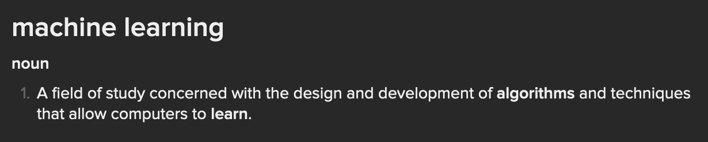

# How to become something you're not (with code)

## What is this machine learning thing about?

<!--
Some notes
-->

---
transition: slide-left
---
# Have you ever wanted to become something you're not?

- 🥼 **Doctor**
- 📈 **Stock trader**
- 👩🏼‍🚀 **Astronaut***

With code & a magic thing called ✨**Machine Learning**✨ you can! You can even do it part time, just like how I became a part time (unpaid) dermatologist 🔬

*probably can't be an astronaut with just code

<!--
I wanted to be a super secret spy when I was younger, the dream is still there

Portrait of me
-->

---
transition: slide-down
---

# What is Machine Learning?

<!--
This is the general conception of what ML is
Scary, killer robots, taking over our lives
-->

---
transition: slide-up
---

# Reality

<!--
The killer robots aren't so scary now right?
-->

---
transition: fade-out
---

# What is Machine Learning?

 
We teach machines to guess what things are, or will, be based on lots and lots of examples
 

---
transition: slide-left
---

# How do machines learn?

